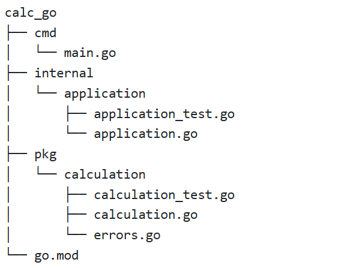

# КАЛЬКУЛЯТОР НА ЯЗЫКЕ GOLANG

Данный калькулятор поможет в простых математических вычислениях с числами

Калькулятор полностью написан на языке Golang в рамках курса "Программирование на Go | 24" от Яндекс.Лицея

---
## Как использовать

Руководство для Windows:
1. Установите Go. Калькулятор написан на версии `go1.23.2`, так что эта версия является приоритетной, но программа может работать на более старых и новых версиях
2. Откройте любую папку в Терминале
3. Через `git clone` скопируйте в локальный репозиторий удалённый репозиторий из https://github.com/ArtemiySps/calc_go:
   
	`git clone git@github.com:ArtemiySps/calc_go.git` 
5. Перейдите в папку calc_go:
   
	`cd calc_go`
6. Введите команду, которая запустит http-сервер на выбранном вами порту (если порт введён не будет, то сервер запустится на порту 8080):

	`go run ./cmd/main.go 8082`
7. В другом терминале ведите запрос вида:

	`curl -X POST -H "Content-Type:application/json" -d "{\"expression\":\"<ваше математическое выражение>\"}" http://localhost:8080/`
	
	Из-за специфики работы Windows, перед всеми двойными кавычками внутри передаваемых json-данных следует ставить обратный слэш (замаскировать кавычки). В примере выше они уже проставлены
9. Результат будет выведен в виде json-данных с единственным полем "result" и результатом вычислений

Для удобства ручного тестирования предлагаю использовать готовые запросы (для сервера, запущенного на порту 8080):

| Выражение                | Запрос                                                                                                                     | Ожидаемый результат                                                        |
| ------------------------ | -------------------------------------------------------------------------------------------------------------------------- | -------------------------------------------------------------------------- |
| 2+2                      | `curl -X POST -H "Content-Type:application/json" -d "{\"expression\":\"2+2\"}" http://localhost:8080/`                     | `{"result":4}`                                                             |
| 2+5*(2+4)                | `curl -X POST -H "Content-Type:application/json" -d "{\"expression\":\"2+5*(2+4)\"}" http://localhost:8080/`               | `{"result":32}`                                                            |
| (2+(3+5)\*(50-(40+6)))+4 | `curl -X POST -H "Content-Type:application/json" -d "{\"expression\":\"(2+(3+5)*(50-(40+6)))+4\"}" http://localhost:8080/` | `{"result":38}`                                                            |
| 3+2*(-3)/7               | `curl -X POST -H "Content-Type:application/json" -d "{\"expression\":\"3+2*(-3)/7\"}" http://localhost:8080/`              | `{"result":2.142...}`                                                      |
| 5+6/0                    | `curl -X POST -H "Content-Type:application/json" -d "{\"expression\":\"5+6/0\"}" http://localhost:8080/`                   | `division by zero` `StatusCode: 422`                                    |
| 5+a                      | `curl -X POST -H "Content-Type:application/json" -d "{\"expression\":\"5+a\"}" http://localhost:8080/`                     | `unexpected symbol` `StatusCode: 422`                                   |
| 5+(5+6                   | `curl -X POST -H "Content-Type:application/json" -d "{\"expression\":\"5+(5+6\"}" http://localhost:8080/`                  | `the number of open and closed brackets is different` `StatusCode: 422` |

## Общая структура файлов

## Логика калькулятора

Все вычисления происходят в файле `pkg/calculation/calculation.go`

Основная функция, из которой вызываются все остальные:
`Calc(expression string) (float64, error)`. В ней обрабатываются ошибки, возникшие внутри остальных функций

После отправки запроса пользователем, входное выражение проверяется внутри функции: `checkString(expression string) error`. Здесь идут проверки с помощью циклов на возможные ошибки ввода (подробнее см. Обработка ошибок)

Затем, происходит разбиение выражения на слайс, где элементами являются строки с числами (или операциями в скобках) с стоящими перед ними знаками. Это происходит в функции: `makeSlice(expression string) []string`. Примеры:

| исходное выражение | полученный слайс     |
| ------------------ | -------------------- |
| `2+2`              | `[+2 +2]`            |
| `2+3*(4+5)`        | `[+2 +3 *(4+5)]`     |
| `2+3*(4+(5+6))`    | `[+2 +3 *(4+(5+6))]` |

Рассмотрим выражение без скобок (к примеру, 2+2). Полученный из него слайс отправляется в функцию `multiplyAndDivision(exp_slice []string) ([]string, error)`. 
В ней слайс перебирается, и происходят вычисления только с теми числами, перед которыми стоит знак умножения или деления. На место этого и предыдущего числа ставится результат операции. К примеру, из `[+2 +3 * 4]` получается `[+2 +12]`

Затем итоговый слайс, где теперь только числа с знаками плюса и минуса, передается в `additionAndSubtraction(exp_slice []string) float64`.
Здесь все элементы просто складываются, и возвращается итоговый результат выражения. Пример: `[+2 +12 -4] -> 10`

Если же в нашем исходном выражении были скобки, то они из слайса вычленяются, берутся как отдельное выражение и пропускаются через `Calc(expression string) (float64, error)`. По сути, это рекурсия. 

В итоге, на место скобки ставится её результат. Знак перед скобкой сохраняется.

Пример: `[+2 +3 *(4+(5+6)] -> [+2 +3 *(4+11)] -> [+2 +3 *15]`

## Обработка ошибок

В калькуляторе обрабатываются различные ошибки ввода.

| Ошибка                                              | Статус сервера            | Пример             |
| --------------------------------------------------- | ------------------------- | ------------------ |
| division by zero                                    | 422 Unprocessable Entity  | 2+5/0              |
| unexpected symbol                                   | 422 Unprocessable Entity  | 2a+6               |
| two operations in a row                             | 422 Unprocessable Entity  | 2++6               |
| operation at the end of expression                  | 422 Unprocessable Entity  | 2-5+               |
| the number of open and closed brackets is different | 422 Unprocessable Entity  | 2+(3+4             |
| no numbers in expresion                             | 422 Unprocessable Entity  | "" (пустая строка) |
| unknown error                                       | 500 Internal Server Error |                    |

Ошибка "unknown error" на данный момент не тестировалась и будет выводиться, если никакая другая ошибка не прошла, однако ошибка всё же есть.

При удачных исходах, код сервера равен 200

## Тесты

В калькуляторе есть встроенные тесты: 
- непосредственно для калькулятора в `pkg/calculation/calculation_test.go`
- для сервера и калькулятора в `internal/application/application_test.go`

## О программисте

Савкин Артемий Алексеевич
16 y.o.
город Краснодар

Студент архитектурного техникума, знатный любитель автоспорта, ещё и программист на Python, Golang

Для связи:
ArtemiyKrd@yandex.ru
